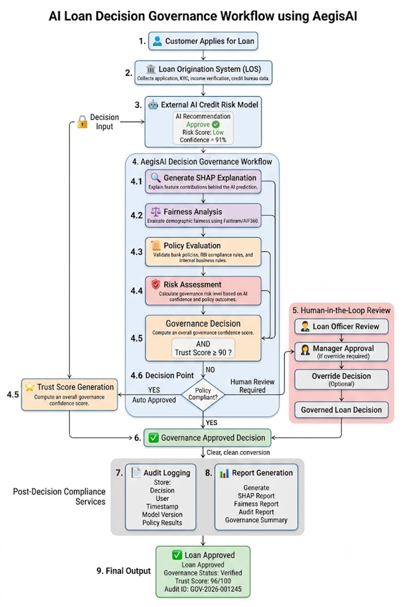
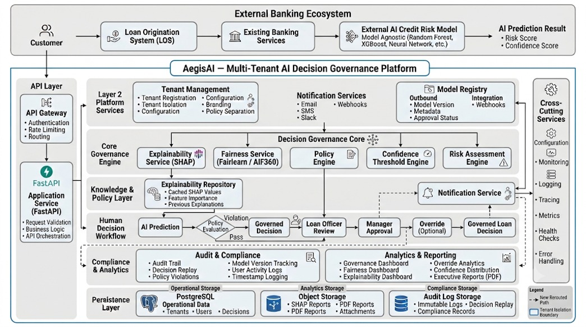
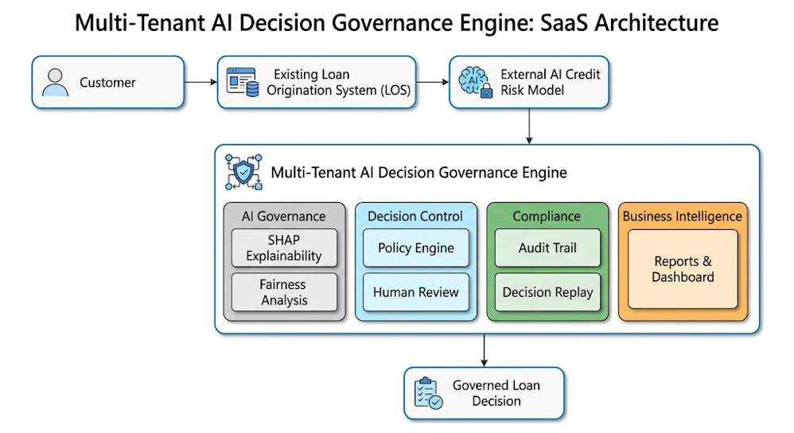

# AegisAI

> AI Governance Platform for Explainable, Auditable and Policy-Compliant FinTech Lending Decisions

## Overview

AegisAI is an AI governance platform being developed as a final-year engineering project to improve transparency, explainability, accountability, and policy compliance in AI-assisted lending systems.

Rather than replacing machine learning models, AegisAI acts as a governance layer between AI predictions and final lending decisions.

---

## Problem Statement

Financial institutions increasingly rely on AI models for credit assessment. While these models improve efficiency, they often operate as black boxes, making regulatory compliance and decision explainability difficult.

AegisAI addresses these challenges through governance, policy validation, explainability, audit logging, and human review workflows.

---

## Objectives

- Improve AI transparency
- Support explainable lending decisions
- Enforce policy-based validation
- Maintain audit trails
- Enable human-in-the-loop review

---

## Planned Features

- Explainability Engine
- Policy Validation Engine
- Audit Logging
- Decision Dashboard
- Human Review Workflow
- Governance Reports
- REST API

---

## Technology Stack

**Backend**
- Python
- FastAPI

**Machine Learning**
- Scikit-learn
- Pandas

**Database**
- PostgreSQL

**Frontend**
- React

---

## Repository Status

This repository currently contains the design and architecture phase of the project. Implementation is under active development.

---

## Development Roadmap

- [x] Problem Definition
- [x] Literature Survey
- [x] System Design
- [ ] Backend Development
- [ ] Explainability Module
- [ ] Policy Engine
- [ ] Dashboard
- [ ] Deployment

## 🏗️ System Architecture

### AI Decision Governance Workflow

---

### Platform Architecture

---

### SaaS Architecture

